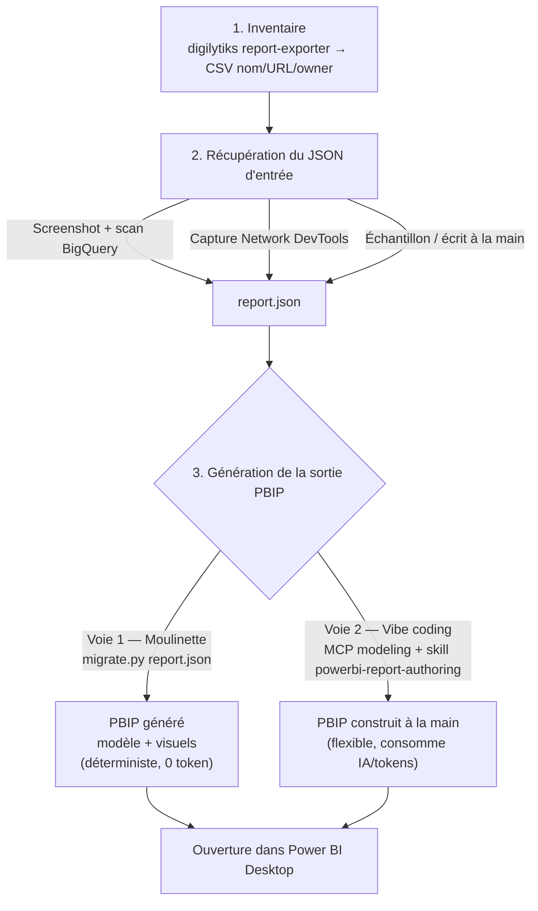
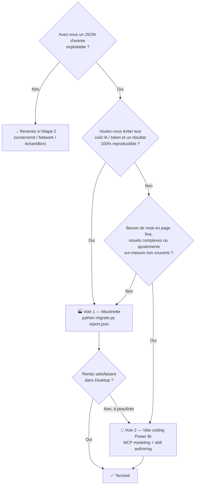

<p align="center">
  
  
  
</p>

<h1 align="center">Migration Looker Studio vers Power BI</h1>

<p align="center">
  <strong>Migrez vos rapports Looker Studio vers Power BI en quelques secondes — entièrement automatisé, sans reprise manuelle.</strong>
</p>

<p align="center">
  <a href="#-quick-start">Démarrage rapide</a> •
  <a href="#-key-features">Fonctionnalités</a> •
  <a href="#-how-it-works">Fonctionnement</a> •
  <a href="#-supported-sources">Sources de données</a> •
  <a href="#-deployment">Déploiement</a> •
  <a href="#-documentation">Docs</a>
</p>

---

## ⚡ Démarrage rapide

Le moteur consomme toujours le **même contrat d'entrée** : un fichier JSON qui suit le
schéma du projet (`{ id, title, dataSources[], pages[], visuals[], parameterControls[] }`).
Une fois ce fichier obtenu, la migration tient en une commande :

```bash
python migrate.py report.json
```

## 🗺️ Workflow global

La migration se déroule en **3 étapes**. La dernière étape offre **2 voies** pour produire
le PBIP : la **moulinette** (déterministe, sans coût IA) ou le **vibe coding Power BI** via
les MCP servers (plus flexible, mais consomme de l'IA et des tokens).



Depuis un **unique JSON d'entrée**, la moulinette produit désormais **le modèle sémantique
complet** (tables + colonnes + mesures DAX + partition M) **et le rapport** (un `visual.json`
PBIR par élément, bindé aux tables/mesures du modèle).

## 🌳 Arbre de décision — quelle voie pour l'étape 3 ?



**En résumé :**

| Critère | 🏭 Moulinette (Voie 1) | 🤖 Vibe coding MCP (Voie 2) |
|---|---|---|
| Coût IA / tokens | Aucun | Consomme IA + tokens |
| Reproductibilité | Totale (déterministe) | Variable |
| Rapidité (lot) | Excellente | Plus lente |
| Mise en page fine / visuels complexes | Basique (grille auto) | Sur-mesure |
| Idéal comme | Bootstrap / migration de masse | Finition / cas complexes |

> [!TIP]
> Meilleure pratique : lancez d'abord la **moulinette** pour obtenir un PBIP complet et
> gratuit, puis n'utilisez le **vibe coding** que pour peaufiner ce qui en a besoin.

> [!IMPORTANT]

> **Looker Studio n'offre aucun export JSON natif ni API publique renvoyant la définition
> d'un rapport.** L'endpoint interne `datastudio.google.com/api` renvoie une page HTML de
> connexion, pas du JSON — toute « extraction live par report ID » est donc non fiable.
> Pour alimenter le moteur, utilisez l'une des **3 approches d'extraction réelles**
> ci-dessous.

### 0️⃣ En amont — inventorier tous vos rapports existants

Avant d'extraire, cataloguez ce que vous avez à migrer. Le script console communautaire
[digilytiks/looker-studio-report-exporter](https://github.com/digilytiks/looker-studio-report-exporter)
scrolle la page d'accueil Looker Studio et copie **la liste de tous vos rapports** (nom,
URL, propriétaire, date de dernière modification) au format **CSV**.

1. Ouvrez Looker Studio, connecté au compte Google concerné.
2. Console DevTools : `Ctrl+Shift+J` (Windows/Linux) ou `Cmd+Option+J` (Mac).
3. Collez le script du repo → Entrée → le CSV est copié dans le presse-papiers.
4. Collez dans Google Sheets / Excel (`Données → Scinder le texte en colonnes`).

> ⚠️ Ce script récupère uniquement les **métadonnées et URLs** des rapports (pas leur
> structure). C'est le point de départ pour appliquer ensuite l'une des 3 approches
> ci-dessous, rapport par rapport.

### 3 façons d'obtenir le JSON d'entrée

**1️⃣ Screenshot + scan BigQuery (recommandé)**
Capturez le rapport Looker, scannez le schéma des sources BigQuery auxquelles vous avez
déjà accès, puis laissez l'outil reconstruire le modèle et le rapport depuis zéro.
```bash
python examples/generate_sample_reports.py \
  --schema-file examples/bigquery_schema.generated.json \
  --screenshot-file report.png --layout-mode auto \
  --output-dir looker_reports_auto
python migrate.py looker_reports_auto/<report>.json
```

**2️⃣ JSON d'entrée écrit à la main (ou un échantillon fourni)**
Les fichiers `looker_reports_*/*.json` sont des **échantillons** qui respectent le contrat
d'entrée. Copiez-en un comme gabarit, ajustez les sources / visuels, puis migrez.
```bash
python migrate.py looker_reports_retail_star/retail_exec_dashboard.json
```

**3️⃣ Capture Network via DevTools**
Ouvrez le rapport → `F12` → onglet **Network** → filtrez **Fetch/XHR** → rechargez →
repérez la requête qui porte la définition du rapport → **Copy → Copy response** →
enregistrez sous `report.json`, puis `python migrate.py report.json`. C'est le seul moyen
de voir le *vrai* JSON interne de Looker Studio (non documenté, plus complexe que le
format maison).

> [!NOTE]
> Voir [docs/LOOKER_EXTRACTION_GUIDE.md](docs/LOOKER_EXTRACTION_GUIDE.md) pour le détail
> complet de ces 3 approches.

> [!TIP]
> La sortie est un projet `.pbip` — double-cliquez pour l'ouvrir dans **Power BI Desktop** (décembre 2025+).

> [!WARNING]
> **Windows MAX_PATH (260 caractères).** Les projets PBIR imbriquent des chemins profonds
> (`…/pages/ReportSectionN/visuals/<nom>/visual.json`). Sous une base longue (ex. OneDrive),
> le chemin total peut dépasser 260 caractères. La génération est protégée (écritures
> `\\?\` longues), mais **Power BI Desktop peut refuser d'ouvrir** un projet trop profond.
> Générez de préférence vers un **dossier court**, par exemple :
> ```bash
> python migrate.py report.json --output-dir C:\pbip
> ```

<details>
<summary><b>📦 Installation</b></summary>

```bash
git clone https://github.com/your-org/Looker-Studio-To-PowerBI.git
cd Looker-Studio-To-PowerBI
python migrate.py report.json
```

**Prérequis :** Python 3.9+ • Aucun `pip install` requis — bibliothèque standard pure.

Optionnel (pour Google Sheets, Analytics ou le déploiement) :
```bash
pip install google-api-python-client google-auth-oauthlib azure-identity requests
```
</details>

---

## ✨ Fonctionnalités clés

| Fonctionnalité | Statut | Notes |
|---------|--------|-------|
| **Import de rapports & tableaux de bord** | ✅ | Analyse du schéma JSON d'entrée |
| **Mapping des sources de données** | ✅ | Google Sheets, BigQuery, GA4, Analytics, YouTube |
| **Conversion des contrôles** | ✅ | Filtres date, texte, listes → paramètres Power Query |
| **Génération des graphiques/visuels** | ✅ | Scorecards, tables, séries temporelles, cartes géo |
| **Conversion des formules** | ✅ | Formules Looker → DAX (180+ correspondances) |
| **Filtres interactifs** | ✅ | Filtrage croisé, sélecteurs de plage de dates |
| **Déploiement** | ✅ | Déploiement direct vers Power BI Service |
| **Migration par lot** | ✅ | Migration de collections entières de rapports |
| **Mode évaluation** | ✅ | Analyse de faisabilité avant migration |
| **Sortie Fabric** | ✅ | Génération de modèles Lakehouse + DirectLake |
| **Thèmes personnalisés** | ✅ | Mapping des couleurs de marque (Looker → Power BI) |

---

## 📋 Autres options de migration

```bash
# 📁 Lot — migrer plusieurs rapports
python migrate.py --batch --input-dir reports/ --output-dir /tmp/output

# 🔍 Évaluation avant migration
python migrate.py report.json --assess

# 🚀 Migrer + déployer vers Power BI Service
python migrate.py report.json --deploy WORKSPACE_ID

# 🧙 Assistant interactif (guidé pas à pas)
python migrate.py --wizard

# 🏭 Sortie native Fabric (Lakehouse + Dataflow + DirectLake)
python migrate.py report.json --output-format fabric

# ⚡ Optimiser le DAX + injecter l'intelligence temporelle
python migrate.py report.json --optimize-dax --time-intelligence auto

# 🌐 Mapper les sources vers des connexions Power BI personnalisées
python migrate.py report.json --datasource-config config.json

# 📊 Générer un rapport d'évaluation de migration
python migrate.py --batch --input-dir reports/ --global-assess
```

---

## 🏗️ Fonctionnement

### 1️⃣ Extraction
- Fournir un rapport sous forme de fichier JSON (schéma d'entrée du projet) ou scanner directement les sources BigQuery
- Récupérer le schéma du rapport et les sources de données
- Analyser les requêtes, formules et contrôles embarqués

### 2️⃣ Transformation
- Mapper les sources Looker vers des connexions Power BI
- Convertir les formules Looker en DAX
- Transformer les contrôles en paramètres Power Query
- Optimiser les schémas de tables

### 3️⃣ Génération
- Créer la structure de projet PBIP
- Générer le modèle sémantique TMDL
- Construire les pages et visuels du rapport Power BI
- Configurer le rafraîchissement et le déploiement

### 4️⃣ Déploiement (optionnel)
- Publier vers Power BI Service
- Configurer la sécurité au niveau des lignes (RLS)
- Définir la planification du rafraîchissement
- Mapper les permissions de données Looker

---

## 📊 Sources de données prises en charge

| Source | Support | Notes |
|--------|---------|-------|
| **Google Sheets** | ✅ Complet | Connecteurs de requête, plages nommées |
| **BigQuery** | ✅ Complet | Requêtes SQL, datasets |
| **Google Analytics 4** | ✅ Complet | Dimensions, métriques, segments |
| **Google Analytics (UA)** | ✅ Complet | Support des propriétés legacy |
| **YouTube Analytics** | ✅ Partiel | Métriques chaîne & vidéo |
| **Admetrics** | ✅ Partiel | Intégrations plateformes pub |
| **Connecteur SAP** | ⚠️ Manuel | Nécessite un mapping personnalisé |
| **Salesforce** | ⚠️ Manuel | Utiliser les connecteurs natifs Power BI |
| **SQL personnalisé** | ✅ Complet | Converti en requêtes T-SQL / DAX |

---

## 🔄 Conversion des formules (180+ fonctions)

### Correspondances courantes

**Formule Looker** → **Équivalent DAX**

| Looker | Power BI / DAX | Exemple |
|--------|---|---------|
| `CASE` | `SWITCH` | `CASE WHEN x THEN y END` |
| `CONCAT` | `CONCATENATE` / `&` | `CONCAT(field1, field2)` |
| `DATE_DIFF` | `DATEDIFF` | `DATE_DIFF(date1, date2, 'day')` |
| `CURRENT_DATE` | `TODAY()` | `CURRENT_DATE()` |
| `SAFE_DIVIDE` | `DIVIDE` | `SAFE_DIVIDE(a, b)` → `DIVIDE(a, b)` |
| `PERCENTILE` | `PERCENTILE.INC` | `PERCENTILE(values, 0.9)` |
| `RUNNING_TOTAL` | `SUM(..., ALL)` | Fonctions de fenêtrage |

📖 **Référence complète :** [FORMULA_CONVERSION_REFERENCE.md](docs/LOOKER_TO_DAX_REFERENCE.md)

---

## 📚 Documentation

- [Vue d'ensemble de l'architecture](docs/ARCHITECTURE.md)
- [Guide de démarrage rapide](docs/QUICK_START.md)
- [Checklist de migration](docs/MIGRATION_CHECKLIST.md)
- [Guide de déploiement](docs/DEPLOYMENT_GUIDE.md)
- [Limitations connues](docs/KNOWN_LIMITATIONS.md)
- [FAQ](docs/FAQ.md)
- [Feuille de route](docs/ROADMAP.md)

---

## 🚀 Déploiement

### Vers Power BI Service
```bash
python migrate.py report.json --deploy WORKSPACE_ID \
    --tenant-id "votre-tenant-id" \
    --client-id "votre-app-id" \
    --client-secret "votre-secret"
```

### Vers Microsoft Fabric
```bash
python migrate.py report.json --output-format fabric \
    --deploy-fabric WORKSPACE_ID
```

---

## 🤝 Contribuer

Les contributions sont les bienvenues ! Merci de lire [CONTRIBUTING.md](CONTRIBUTING.md) pour les détails.

---

## 📄 Licence

Ce projet est sous licence MIT — voir [LICENSE](LICENSE) pour les détails.

---

## ❓ Support & Communauté

- 📖 [Documentation](docs/)
- 🐛 [Signalement de bugs](https://github.com/your-org/Looker-Studio-To-PowerBI/issues)
- 💬 [Discussions](https://github.com/your-org/Looker-Studio-To-PowerBI/discussions)
- 🔗 [Outils associés](https://github.com/your-org/Looker-Studio-To-PowerBI/wiki)

---

**Fait avec ❤️ par la communauté Looker Studio → Power BI**
